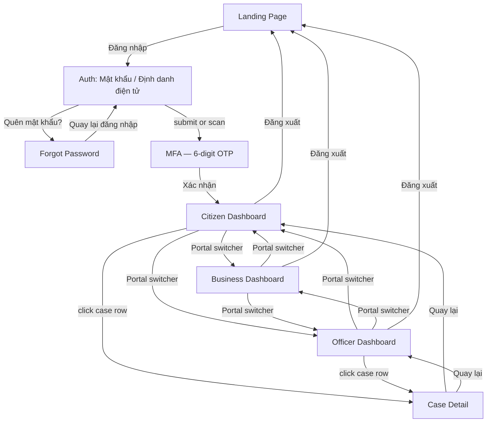

# User Flow

How a person actually moves through the prototype. All transitions below are real — implemented in `preview-app/src/App.tsx`'s navigation state and independently verified by clicking through them in the running dev server (see `DEMO_REPORT.md`).

## Key behaviors worth knowing

- **Case Detail "back" is context-aware.** Opening a case from the Citizen Dashboard vs. the Officer Dashboard and clicking "Quay lại" returns to whichever one it was opened from — tracked via `caseOrigin` state in `App.tsx`, not hardcoded to a single screen.
- **Portal switcher only appears while "logged in."** Before login, the Header shows plain nav links (`Trang chủ`, `Hồ sơ của tôi`) and an "Đăng nhập" CTA. After MFA succeeds, the Header replaces that nav with the Công dân / Doanh nghiệp / Cán bộ pill switcher — this is how a reviewer jumps between the three role-specific dashboards without needing three separate logins.
- **Logout is a hard reset.** "Đăng xuất" clears the logged-in state and returns to Landing; the Portal switcher disappears and the plain nav returns.
- **Auth screens are standalone.** `auth`, `mfa`, and `forgot-password` render full-bleed, without the shared `Header`/`AIAssistantPanel` chrome — consistent with how a real gated login flow looks (no site nav until you're in).
- **Business Dashboard has no drill-down.** Its rows are informational only — connecting it to Case Detail was not part of the requested flow (only the Citizen/Officer → Case Detail path was requested).

## Entry points into the reference view

The "Xem Design System" / "Xem Prototype" toggle (top-right, always visible) is independent of the flow above — it swaps the entire app between the prototype (this flow) and the raw component/token/asset reference (`PAGE_MAP.md`'s "Reference view" section). Switching back always returns to wherever the prototype flow was left.
